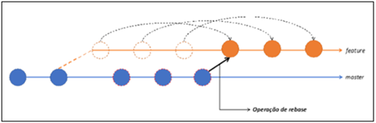

# git-flow

<a name="home"></a>
### Indice

- [Introdução](#intro)
- [Feature](#feature)
- [Release](#release)
- [Hotfix](#hotfix)
- [Conflitos](#conflitos)
- [Comandos Comuns](#comandos)
- [Release](#release)
- [Release](#release)

---
<a name="intro"></a>
### Introdução - [**[indice]**](#home)

   <br>

**Master:** código executado em produção.<br>
**Hotfix:** Criada quando há um bug em produção. Os ajustes realizados são aplicados na master e na de desenvolvimento, assim mantendo todos atualizados.<br>
**Release:** Preparação para que o desenvolvimento entre em produção. Quando a release é finalizada ela faz um merge com a master, também volta para desenvolvimento para atualizar o que foi alterado.<br>
**Develop:** Desenvolvimento, criada a partir da master.<br>
**Feature:** Criada a partir do desenvolvimento, serve para adicionar uma nova funcionalidade. Quando finalizada, ela é mergeada para a desenvolvimento (pull request).<br>

---
<a name="feature"></a>
### Trabalhando com Features: - [**[indice]**](#home)
- Realizar o clone do projeto, fazer o pull para garantir que está atualizado localmente.

- Criando a feature:
```
git flow feature start "ARQ-1405-Ajustar-Validacao"
```
>[!NOTE]  
> automaticamente realizará o checkout para a nova feature.

- Após realizar alterações, utilize o comando para visualizar os arquivos modificados:
```
git status
```

- Adicione ao Stage todos os arquivos modificados:
```
git add .
```

- Informe a mensagem do commit:
```
git commit -m "ARQ-1405 – ajuste de validacao"
```

- Adicione a feature local no repositório:
```
git flow feature publish
```

- Criar o pull request:
Acessar o bitbucket, clicar em create (pull request), adicionar a descrição, conferir os revisores e marcar close branch para ela ser encerrada e mergeada com desenvolvimento (neste caso).<br>

- Realize os comandos para atualizar a branch desenvolvimento local:
```
git checkout desenvolvimento
git pull
```

---
<a name="release"></a>
### Trabalhando com Release: - [**[indice]**](#home)
- Acesse a branch de desenvolvimento e atualize a branch local:
```
git fetch --all && git pull
```

- Verificar a última tag criada:
```
git describe --tags
```

- Criar a release (tag):
```
git flow release start 1.4.0
```

- Publicar a release:
```
git flow release publish
```

- É aconselhável atualizar os branches release, desenvolvimento e master antes da finalização.

- Fechar a release:
```
git flow release finish 1.4.0
```

- Irá realizar o merge com a master, caso tenha commit na release, ele retornará para desenvolvimento. Assim todos os branchs ficarão atualizados.

- Ao término irá abrir no bash o vim (editor de texto) para adicionar a mensagem. Caso tenha o git extensions, abrirá uma janela gráfica para escrever a mensagem.
Comandos Vim: “:q” quit, “cq” quit without writing, “wq” write and quit, “:e” edit, “e!” edit and discard changes.
Adicione a mensagem: 1.4.0

- Caso dê tudo certo, exibirá: merge into master, release tagged 1.4.0, release back-merged into desenvolvimento, release/1.4.0 locally deleted, remotely deleted, e fará o checkout para desenvolvimento.

- Enviar as alterações locais para o remoto:
```
git push --tags
git flow release finish 1.4.0
```

- Para atualizar a branch de desenvolvimento remoto digite:
```
git push
```

- Realizar o mesmo processo para a master:
```
git checkout master e git push
```

---
<a name="hotfix"></a>
### Trabalhando com Hotfix: - [**[indice]**](#home)
- Acessar a master e realizar o comando:
```
git fetch --all & git pull
```

- Verificar última tag criada:
```
git describe --tags
```

- Criar a hotfix:
```
git flow hotfix start 1.4.1
```

- Publicar no remoto:
```
git flow hotfix publish
```

- Realizar o checkout para p hotfix se estiver em outra branch:
```
git checkout hotfix/1.4.1
```

- Seguir com a correção, adicionar ao Stage as modificações, realizar o commit e enviar os dados:
```
git add .
git commit -m "ARQ-1405 – ajuste de validacao"
git push
```

- Verificar se não há alteração remota:
```
git fetch --all && git pull
```

- É aconselhável atualizar os branches de hotfix, desenvolvimento e master antes da finalização.

- Encerrar o hotfix:
```
git flow hotfix finish 1.4.1
```

- Abrirá o editor de texto para inserir o comentário da tag, ex: 1.4.1.

- Fechará o hotfix, realizará o merge com a master, desenvolvimento e deletará a branch hotfix.

- Realizar o: git push para enviar as alterações em desenvolvimento.

- Subir as tags:
```
git push --tags
```

- Fazer o mesmo processo para a master:
```
git checkout --master
```

- Enviar as alterações:
```
git push
```

---
<a name="conflitos"></a>
### Resolvendo Conflitos: - [**[indice]**](#home)
#### Alinhar:
- Quando ocorrer conflitos e você não for o único desenvolvedor, alinhar com os outros devs quais dados manter.

- Alterar os testes unitários se for o caso, testar a aplicação para ver se está ok.

#### Pull Request:
- Criar o pull request e caso dê conflito, fazer os seguintes passos:
Atualizar a branch de desenvolvimento;<br>
Ir para a feature e digitar:<br>
```
git merge desenvolvimento (mescla todas as alterações de desenvolvimento com a feature).
```

- Abrir o KDiff3: git mergetool
selecionar o quadrante desejado para solucionar o conflito. Tela dividida em Base (Quadrante A), Local (Quadrante B) e Remoto (Quadrante C).<br>
   <br> 

- Realizar o commit da solução do conflito:
```
git commit (gerará a mensagem default).
```

- Enviar as alterações: 
```
git push
```

#### Detached Head:
- Caso ocorra conflito no Pull Request e o GIT peça para fazer um Sync now:
   <br> 

- O Bitbucket indicará o ponto do conflito pedindo pra criar uma Detached Head:
   <br>
   
>[!NOTE]  
> no caso o merge da imagem é demonstrativo, mas você fará o merge para a desenvolvimento ou master e commitará a solução para a sua feature remota.

- Comando para publicar a resolução do conflito:
```
git push origin HEAD:feature/nome-da-feature
```

- Após o commit realizado o merge será liberado no Pull Request:<br>
   <br>
   
---
<a name="comandos"></a>
### Comandos mais utilizados: - [**[indice]**](#home)

#### Configurações:

<ins>Verificar usuário configurado:</ins>
```
git config user.name
git config user.email
````

Caso não tenha config, realizar os comandos as seguir:
```
git config --global user.name "<nome_do_usuario>"
git config --global user.email "<email_do_usuario>"
```

<ins>Inicializar projeto GIT:</ins>
```
git init
```

<ins>Criando a referência para o repositório:</ins>
```
git remote rm origin
git remote add origin <novo_repositório_a_ser_apontado.git>
```

<ins>Verificar os status do projeto:</ins>
```
git status
```

<ins>Criar o arquivo .gitignore:</ins>
```
touch .gitignore
```

<ins>Criar o arquivo README:</ins>
```
touch README.md
```

<ins>Para "trackear" (adicionar) os arquivos:</ins>
```
git add .gitignore //nome do arquivo que você quer adicionar ao git
ou
git add . //adiciona todas as modificações ao git
ou
git add -A //adiciona e acompanha todas as modificações trackeadas e não trackeadas ao git
ou
git add *.<extenção do arquivo>
```

#### Commit:

<ins>Aplicar o commit:</ins>
```
git commit -m "início do projeto" // mensagem de identificação da alteração (sempre colocá-lo entre aspas)
```

<ins>Reescrever o Commit Local Antes do Push (Reword last commit):</ins>
```
git commit --amend
ou
git commit --amend -m "<texto_do_commit>"
```

<ins>Interactive Rebase do commit:</ins>
```
git rebase -i //ações interativas do rebase, abrirá uma janela com a lista de commits.
```
> [!TIP]
> Para editar pressione “s” para entrar no modo insert e “esc” para sair do modo insert.
>
> Opções da refatoração aceitas:
> p(pick) = usar o commit atual;
> r(reword) = usa o commit e edita a mensagem;
> e(edit) = usa o commit, mas não faz o amend;
> s(squash) = usa o commit, mas mescla com o commit anterior
> f(fixup) = semelhante ao squash, mas descarta o log de commit
>
> Exemplo:
> git rebase -i HEAD~2
>
> 
> Aparecerá os dois últimos commits no modo de edição:
> pick e499d89 Initial commit
> pick 0c39034 Fixed types
>
> Escolher qual commit deseja alterar:
> reword 0c39034 <novo_texto>
>
> OBS: A cada alteração salve e feche a lista de commits.
>
> Atualize o repositório com o comando:
> git push --force

<ins>Voltar para um Commit Específico Localmente:</ins>
```
git reset --hard <hash_do_commit> //elimina os commits posteriores ao hash selecionado
```

<ins>Voltar para um Commit Especifico Remotamente:</ins>
```
git reset --hard <hash_do_commit>
git add .
git commit -m "<texto_do_commit>"
git push -f origin <nome_da_branch> //-f (força as substituições)
```

<ins>Deletar o histórico de Commit no Repositório do Github:</ins>
```
AVISO: Esta ação removerá completamente seus antigos commits. Não podendo recuperá-los.
git checkout --orphan temp_branch //Criando uma nova branch que não é mostrada pelo comando 'git branch'
git add -A //Add todos os arquivos na nova branch criada
git commit -am "o primeiro commit" //add uma nova commit
git branch -D master //deleta a branch master do seu repositório git
git branch -m master //após deletar a master, vamos renomear a nova branch para master
git push -f origin master //após todas essas mudanças, forçe um push com suas novas mudanças e pronto!
```

#### Repositório:

<ins>Verificar qual repositório está configurado:</ins>
```
git remote -v
```

<ins>Conectar ao repositório na nuvem:</ins>
```
git remote add origin minhaUrl.git // colocar o link do repositório
```

<ins>Buscar mudanças no destino:</ins>
```
git fetch origin
```

<ins>Baixar as mudanças no destino:</ins>
```
git pull origin
```

<ins>Visualizar todos os commits:</ins>
```
git log
```

<ins>Clonar Projeto do Repositório:</ins>
```
git clone --branch <nome_da_branch> <url_da_branch>
ou
git clone <url_da_branch> //nesse caso ele sempre observará a master
```

<ins>Visualizar Branchs existentes:</ins>
```
git branch -a
```

<ins>Trocar de Branch Local:</ins>
```
git checkout <nome_da_branch>
```

<ins>Trocar de Branch Remota:</ins>
```
git checkout origin/<nome_da_branch>
```

<ins>Criar Nova Branch Local:</ins>
```
git checkout -b <nome_da_branch>
```

<ins>Deletar Branch Local:</ins>
```
git branch -d <nome_da_branch>
ou
git branch -D <nome_da_branch>
```

<ins>Subir a Nova Branch Local para o Repositório (Remoto):</ins>
```
git push origin <nome_da_branch>
ou
git flow <nome_da_branch> publish
```

<ins>Deletar a Branch Remoto:</ins>
```
git push --delete origin <nome_da_branch>
ou
git push origin :<nome_da_branch>
```

<ins>Comparar Branch:</ins>
```
git diff <branch_raiz> <branch_destino>
```

<ins>Comparar Diferenças Dentro de uma Branch:</ins>
```
git diff
```

#### HEAD:
<ins>Visualizar o HEAD COMPLETO de um Commit:</ins>
```
git rev-parse HEAD
```

<ins>Visualizar o HEAD CURTO de um Commit:</ins>
```
git rev-parse --short HEAD
```

#### TAGS:

<ins>Criação de Tags (Rotulação):</ins>
```
git tag <nome_da_tag> <hash_do_commit> //hash_do_commit = número_do_commit
git push --tags origin <nome_da_branch>
```

<ins>Deletar Tag Local:</ins>
```
git tag -d <nome_da_tag>
```

<ins>Deletar Tag no Repositorio:</ins>
```
git push origin :<nome_da_tag>
```

#### Conflitos:

Correção de Conflito para Tag e Branch com o Mesmo Nome:<br>

<ins>Para deletar Tag:</ins>
```
git push origin :refs/tags/<nome_da_tag>
```

<ins>Para deletar Branch:</ins>
```
git push origin :refs/heads/<nome_da_branch>
```

#### MERGE X REBASE:

O git merge e o git rebase são duas formas de integrar mudanças de uma branch em outra no Git.<br>

A diferença entre MERGE e REBASE é que enquanto o MERGE mescla os projetos e cria um commit (projeto público e mantém o histórico), o REBASE coloca as modificações após o último commit e cria um commit no final (projeto privado e não mantém o histórico).<br>

> [!NOTE]
> é necessário estar na Branch que você quer receber as modificações e aplicar esse comando sempre chamando a branch que deseja juntar.

<ins>Merge:</ins><br>
O merge basicamente cria um novo commit no branch onde o merge é realizado. Este commit puxa consigo a última referência do branch a partir do qual o merge é realizado. Este commit “especial” é chamado de merge commit.<br>

Ele combina o histórico de duas branches sem alterar o histórico existente. Ele cria um commit de merge, que une os commits das branches em um ponto comum.<br>
   <br>
   
<ins>Rebase:</ins><br>
O rebase literalmente unifica os branches envolvidos, puxando os commits para frente do branch de destino. É como se ele estivesse “refazendo” a base do branch onde o comando é executado.<br>

Ele "move" os commits de uma branch para aplicá-los em cima de outra. Ele "recria" os commits, como se você tivesse começado o trabalho na nova base (branch), sem criar um commit de merge.<br>
   <br>

#### Alterações:

<ins>Salvando alterações locais sem realizar o commit:</ins>
```
git stash //coloca no cache os arquivos – opções: "pop" remove e "apply" atualiza.
```

<ins>Remover as Alterações Locais:</ins>
```
git checkout --<nome_do_arquivo> //remove o arquivo escolhido
```

<ins>Remover permanentemente as Alterações Locais:</ins>
```
git reset --hard //remove todas as alterações
```

<ins>Corrigir o Arquivo .gitignore:</ins>
```
git rm -r --cached .
git add .
git commit -m "<texto_do_commit>"
git push origin <nome_da_branch>
```

<ins>Remover arquivos não trackeados:</ins>
```
git clean -n para ver uma dry run.
git clean -f para forçar deletar untracked files.
git clean -f -d para  remove diretórios untracked.
git clean -f -x para remover untracked .gitignore.
-i muda para o modo interativo.
```
